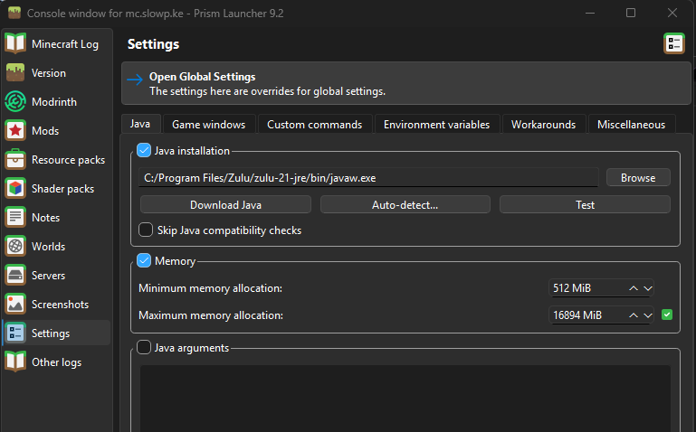

## Prerequisites

1. Download and Install JRE 21 from Adoptium: [https://www.azul.com/downloads/?version=java-21-lts&os=windows&architecture=x86-64-bit&package=jre#zulu](https://www.azul.com/downloads/?version=java-21-lts&os=windows&architecture=x86-64-bit&package=jre#zulu)

   a. **Choose Download and the `.msi` installer**

2. Download and Install [https://prismlauncher.org/download/](https://prismlauncher.org/download/)

## Installing / Updating

With Prism opened,

`Add Instance` Button → Choose `Import` → Paste link [`https://slowp.ke/mc.slowp.ke.mrpack`](https://slowp.ke/mc.slowpoke)

Once the instance is added,
Right Click → Edit → Settings → Tick "Memory" and set "Maximum Memory allocation" to at least 8192MB (8GB). If you have more RAM, you can put a bigger number here like 16384MB (16GB).

## Exporting in Prism (for Austin)

1. `Right Click` Instance → `Export...` → `Modrinth`
2. Bump version
3. Ensure the following items are unticked, to prevent people from losing their settings:
   - `options.txt`
   - `config/emi.css`
   - `config/iris.properties`
   - `config/sodium-*`
